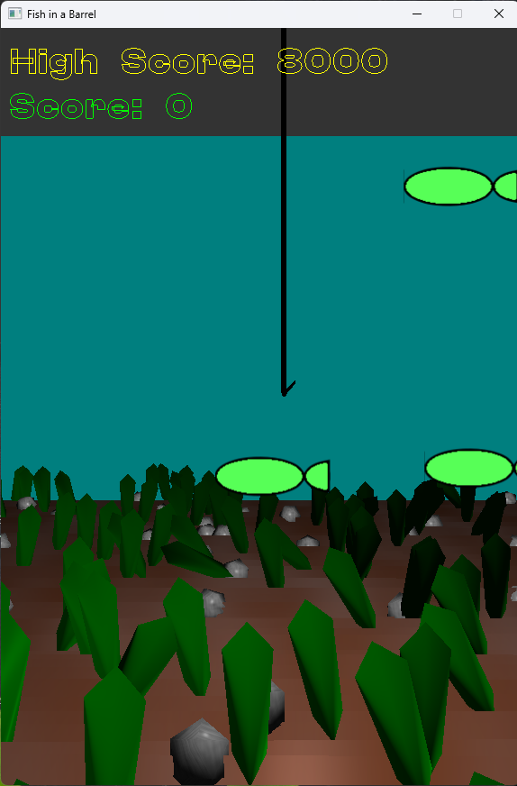

Fish In A Barrel
================

Description:
------------

A fast-paced, arcade-style fishing simulator.

Dive into a vibrant underwater world where 2D fish sprites dart and weave through a stunning 3D environment.

Control your hook with intuitive controller inputs, maneuvering it with precision to snag elusive fish.

Test your reflexes and timing as you reel in your catch in this thrilling and challenging fishing experience.

This project is open source, encouraging collaboration and innovation within the gaming community.

Features:
---------

* Unique Blend, combination of 2D and 3D elements.
* Fast-Paced Action: Arcade-style gameplay.
* Open Source

System Requirements
-------------------

* Windows
* Java JDK

Screenshots:
------------

